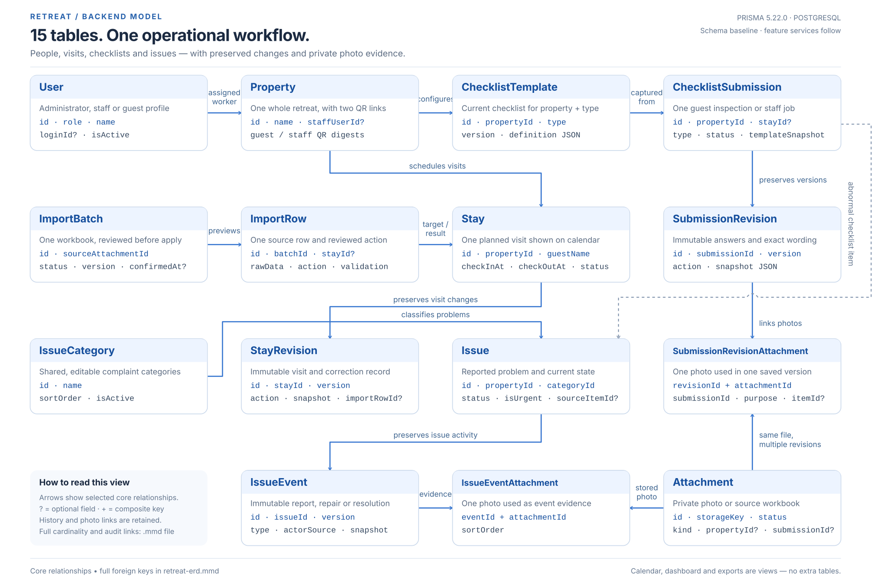
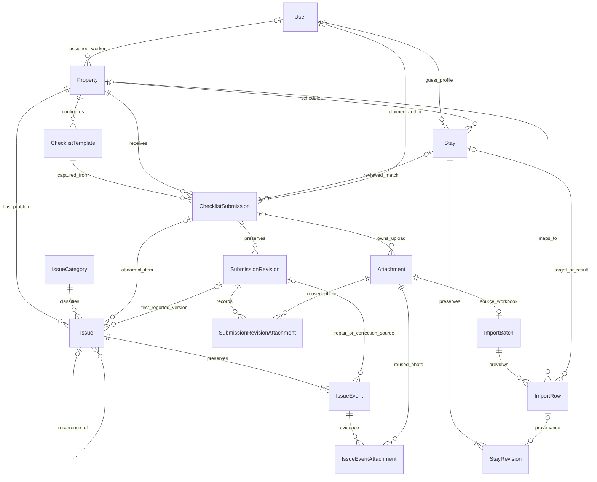

# Retreat MVP data model

This is the complete first-release **schema baseline**, not completed feature APIs.
Prisma 5.22.0 and PostgreSQL remain unchanged. The administrator authentication
already implemented continues to use the same User fields.

The model has **15 tables**: the original 11-model sketch plus StayRevision,
ImportRow, and two photo-link tables. A property is one entire retreat.
There is no separate room, booking-payment, subscription, or tenant model.

See [the full column dictionary](data-dictionary.md) for every stored field and
[the ER diagram source](retreat-erd.mmd) for the complete relationship diagram.



The visual overview shows the main relationships. The ER source includes every
foreign key, and the column dictionary defines the exact field names.

## What each table means

| Table | One row means | Why it exists |
|---|---|---|
| User | A person profile with ADMIN, STAFF, or GUEST role | Shared people model; only administrators need login credentials now. |
| Property | One whole retreat | Region, current worker assignment, separate guest/staff QR digests. |
| Stay | One planned guest visit | Calendar dates, guest details, current cancellation state. |
| StayRevision | One immutable version of a stay | Preserve manual and imported corrections and cancellations. |
| ImportBatch | One uploaded roster and its preview | Confirm an upload once before changing the calendar. |
| ImportRow | One source sheet/row within that upload | Retain original cells, mapping, validation, decision, and applied changes. |
| ChecklistTemplate | The current checklist for one property and type | Editable maintenance sections/items; fixed guest checklists and Jeju car section. |
| ChecklistSubmission | One guest inspection or one staff maintenance job | Draft/start/completion state, calendar matching, private access, captured template. |
| SubmissionRevision | One immutable submitted version | Original answers, corrections, cancellation, actor, and exact wording. |
| Attachment | One private stored photo or source workbook | Upload state, storage location, metadata, and ownership. |
| SubmissionRevisionAttachment | One photo's use in one submitted version | Reuse unchanged photos across revisions without losing the original references. |
| IssueCategory | One shared complaint category | Administrator can add, rename, reorder, and deactivate categories. |
| Issue | One reported problem | Current urgency, status, source item, recurrence, resolution, cancellation. |
| IssueEvent | One immutable event in that problem's history | Reports, repair claims, administrator resolution, and corrections. |
| IssueEventAttachment | One photo used as evidence for one issue event | Retain report/repair evidence even if a later event uses different photos. |

## Core relationships



The minimum one revision/event shown for created stays/issues is a **service
transaction invariant**. Foreign keys do not independently force a child row to
exist. The full ER source also includes administrator/audit-user relationships.

## How the records work together

### 1. Administrator setup

Create a STAFF User and a Property, then set Property.staffUserId. One worker may
cover several properties; each property has at most one current assignee. Assign
only an active STAFF profile. Reassign or unassign their properties before
deactivating a worker. Retain old authors in stored snapshots.

The single manager's shared call/SMS contact can use the active administrator's
User.phone. The public contact response exposes only that intended contact number;
it never returns a general User record. Setup must configure this phone before
showing an enabled contact button. This does not implement automatic SMS delivery.

### 2. Calendar and roster import

A Stay contains a stable ID, property, guest identity snapshots, and actual arrival
and departure instants. A guest profile link is optional. Identical names/phones
do not prove that two people or stays are the same.

Manual create/correct/cancel writes Stay and a complete StayRevision atomically.
The same stable Stay.id survives date/guest corrections. A stay's property is
immutable after creation; cancel/recreate a visit assigned to the wrong property,
with an explanatory revision, rather than silently moving linked records. source records
how the stay was originally created, not the most recent editing method.

For Excel: create a READY IMPORT_SOURCE Attachment, then ImportBatch and rows.
Preview each sheet/row, map managed properties, identify actual visits, and choose
CREATE, UPDATE, or SKIP. Availability rows and unmanaged sheets are skipped.
Row numbers and email-like account values are not permanent booking IDs.

Confirmation atomically claims the batch's PREVIEW state and expected version,
checks each target Stay.currentRevision, applies approved rows, appends revisions,
stores before/after snapshots, then marks the batch CONFIRMED. A confirmed batch
and its rows are immutable. Duplicate confirmation must not apply twice. An
invalid/unresolved row must be corrected or deliberately skipped before applying.
Missing rows in a later upload **never imply cancellation**.

ImportRow.stayId is an existing reviewed UPDATE target, or is populated with the
created stay after CREATE. A skipped row may have no target. Its beforeSnapshot,
afterSnapshot, and linked StayRevision explain exactly what was applied. An applied
row must have a property, resulting stay, afterSnapshot, and appliedAt; the linked
StayRevision must belong to that same stay. Changing a target's property is not
an allowed UPDATE operation.

Timestamp columns use timestamptz for new records. Display/group using Asia/Seoul.
Preserve original timestamp strings in rawData; do not guess that midnight source
times mean standard check-in hours. visitDate is a local date, stored as SQL date.

### 3. Checklists and maintenance

There is one current ChecklistTemplate per property and type: CHECK_IN, CHECK_OUT,
MAINTENANCE. Guest forms are configured from the supplied fixed checklists; the
maintenance editor may change sections, items, order, and required flags.
Jeju rental-car checks are another template section, not another asset subsystem.

Starting a draft captures templateVersion and templateSnapshot on the submission.
Changing the live template must never change that captured template or any saved
revision. Existing drafts retain their captured version; new drafts use the new
version. Draft answers may be updated until submission.

For maintenance, persist startedAt immediately so the administrator can see work
starting. Completing a job sets submittedAt and appends the first full revision.
Corrections append another revision, with optimistic currentRevision checking.
Cancellation/restoration also append a complete snapshot. submittedAt preserves
the original successful submission time, not the latest edit time.

Guest entry/exit records may initially have no stayId. A server/admin-reviewed
match links the correct stay; that correction is recorded in a revision. A
foreign key guarantees the selected stay/template belongs to the submission's
property. The service also validates the template type, guest/staff flow, and
whether the stay date is appropriate. Maintenance jobs do not satisfy guest checks.

### 4. QR and private links

Property stores independent guestQrTokenHash and staffQrTokenHash values. Generate
cryptographically random tokens; store only a digest. A null digest or inactive
property disables the corresponding entry point. Rotate guest/staff tokens
independently. Return printable QR content on issuance; a stored hash cannot
reconstruct an old token. If the original QR file is lost, issue a replacement.

A QR resolves the property and permitted input flow. It does not prove who scanned
it. STAFF profile attribution is a claim tied to the assigned person, not a login.
Public QR routes must never return roster data, previous submissions, private link
tokens, or issue history. Only the administrator can browse history.

ChecklistSubmission.privateTokenHash is a separate per-submission capability.
Guest links permit viewing/correcting only that record. For a staff job, use a
work-session token while drafting, then stop staff read/edit access after completion;
keep historical access administrator-only. Rotation/revocation must be supported.
privateTokenExpiresAt supports a chosen expiration policy; null means no configured
expiry, not a promise about indefinite access. Delivery by SMS/Kakao is undecided.
Standalone complaints use Issue + its first IssueEvent; guest complaint editing is
not an additional confirmed feature in this schema baseline.

### 5. Photos and issue reports

Create an Attachment before uploading, with server-issued ownership and limits.
For checklist photos, attach it to its draft submission. For a direct complaint,
use a short-lived upload claim before the Issue exists. Consume/clear that claim
when linking the file to its first event, checking existing links to prevent reuse
by another anonymous reporter. Confirm actual object
metadata and content before marking it READY. Never trust client-supplied storage
paths, content type, file size, ownership IDs, or upload status.

PHOTO requires a property. IMPORT_SOURCE requires administrator ownership and no
submission. Checklist photo joins use compound foreign keys so the revision and
photo belong to the same submission. A file may be referenced from multiple
revisions and issue events. Cleanup may remove expired unreferenced pending files;
it must never remove files referenced by any historical record. READY file metadata
and final ownership are immutable. Persist storage keys, not expiring signed URLs.

Defect descriptions/photos and maintenance-before photos are optional. Maintenance
after photos are grouped by section/item/area; expected volume is roughly 15–30.
Exact mandatory areas and upload limits belong in validated template/runtime rules.

An abnormal item creates an Issue and its first IssueEvent in the submission
transaction. (sourceSubmissionId, sourceItemId) deduplicates it across revisions.
sourceRevisionId points to the original reporting version. Later changes append
events; do not overwrite original evidence, create duplicate problems, or silently
resolve/cancel an issue when an answer becomes normal or a submission is cancelled.

A direct complaint creates an Issue and REPORTED event with claimed author details
and optional photos. requestKey prevents duplicated requests, but is never access
authorization. A title may be generated from the selected category/item when the
guest gives no description. Categories are shared and editable; category names are
captured in event snapshots to preserve historical labels.

Staff repair claims create REPAIR_REPORTED events. Only an authenticated active
administrator can resolve the Issue. A new recurrence links a previous issue in
the same property; the UI derives its recurrence marker from that link. Validate
that the earlier issue is resolved and reject self-links/cycles. Cancellation is
an archive flag separate from NEW → IN_PROGRESS → RESOLVED; retain all events.

## JSON contracts: structured, validated data

JSON is used for flexible checklist definitions and complete historical snapshots.
It is not a substitute for validating DTOs. Each payload has schemaVersion: 1.
IDs inside checklist JSON are stable UUIDs created by the server, not item labels.
Array order controls display order. Never reuse a deleted item's ID for a new item.
Photos are linked through the relational join tables, not hidden as JSON ID arrays.

### ChecklistTemplate.definition and captured templateSnapshot

```json
{
  "schemaVersion": 1,
  "sections": [{
    "id": "<stable-section-uuid>",
    "title": "욕실",
    "items": [{
      "id": "<stable-item-uuid>",
      "label": "온수가 정상적으로 나오나요?",
      "required": true,
      "answerType": "NORMAL_ABNORMAL"
    }]
  }]
}
```

### draftAnswers and the answers field in SubmissionRevision.snapshot

```json
{
  "schemaVersion": 1,
  "items": [{
    "itemId": "<stable-item-uuid>",
    "value": "ABNORMAL",
    "description": "온수가 나오지 않습니다.",
    "categoryId": "<active-issue-category-uuid>",
    "isUrgent": true,
    "repairReported": false,
    "repairNote": null
  }],
  "generalNote": null
}
```

value is NORMAL or ABNORMAL. Description/category/urgency fields apply to abnormal
items; a defined fallback category supports reports without an explicit choice.
repairReported and repairNote are staff/admin input only. They never grant issue
resolution. Missing/unanswered required items prevent final submission. Validate
duplicate item IDs, unknown items, inappropriate roles, lengths, and nested shapes.

### Historical payloads

| JSON field | Required meaning |
|---|---|
| StayRevision.snapshot | schemaVersion; all current Stay scalar data; property name; guest identity snapshots; status/cancellation metadata. |
| ImportRow.rawData | schemaVersion; original headers/cells and original timestamp strings, preserving source ambiguity. |
| ImportRow.normalizedData | schemaVersion; proposed property/guest/date values and normalization decisions shown in preview. |
| ImportRow.validationMessages | Array of { code, field, message, severity }; no raw internal error dumps. |
| ImportRow.beforeSnapshot / afterSnapshot | The same complete Stay snapshot contract, before and after an applied row. |
| ChecklistSubmission.authorSnapshot | schemaVersion; claimed name, company, department, phone if supplied, and role/context selected by the server. |
| SubmissionRevision.snapshot | schemaVersion; submission type/status/dates/property label; reviewed stayId; captured template version/title/definition; full author snapshot; full answers; cancellation state. |
| actorSnapshot on history rows | schemaVersion; actor's name/role at the time, or a system label; actorSource distinguishes administrator authentication from QR/link claims. |
| IssueEvent.snapshot | schemaVersion; complete resulting Issue state, category/property labels, source references, recurrence reference, resolution/cancellation metadata. |

All complete snapshots are made by the service from validated current state, not
accepted as arbitrary history JSON from a browser. Use explicit DTO classes for
nested checklist shapes and typed internal snapshot builders.

## Planned DTOs and services

Staff/property management, manual stays, and checklist templates are implemented as described in
[the administrator API guide](admin-management.md), [stay API guide](admin-stays.md),
and [template API guide](admin-checklist-templates.md).
The other feature names below
remain an implementation guide, not newly implemented classes.
Each feature gets its controller/service/module under components and inputs plus
response contracts under libs/dto, following the existing Jagong-style structure.

| Feature module | Main input DTOs | Response contracts | Service responsibility |
|---|---|---|---|
| users (existing) | LoginInput; CreateStaffInput, UpdateStaffInput, GetStaffInput | AuthenticatedUser, LoginResponse; StaffDto, StaffListDto | Keep admin login; create/edit/deactivate STAFF profiles; no public role escalation. |
| properties | CreatePropertyInput, UpdatePropertyInput, GetPropertiesInput, AssignStaffInput | PropertyDto, PropertyListDto | Property CRUD and active STAFF assignment; exclude token hashes from every response. |
| stays | CreateStayInput, UpdateStayInput, CancelStayInput, GetStaysInput | StayDto, StayListDto, CalendarStayDto | Stable visits, guest snapshots, conflicts, corrections, cancellation, StayRevision transactions. |
| imports | CreateImportInput, UpdateImportRowInput, ConfirmImportInput | ImportPreviewDto, ImportRowDto, ImportResultDto | Parse fixed workbook, preview/mapping, validation, concurrency-safe confirmation. |
| checklist-templates | CreateChecklistTemplateInput, UpdateChecklistTemplateInput, GetChecklistTemplatesInput; ChecklistSectionInput and ChecklistItemInput | ChecklistTemplateDto, ChecklistTemplateListDto | Per-property configuration, stable IDs, type rules, expected-version checks. |
| qr | RotatePropertyQrInput; scoped URL token | QrIssueDto, PublicPropertyDto | Issue/rotate QR capabilities; resolve safe context; enforce flow scope. |
| submissions | StartSubmissionInput, SaveDraftInput, SubmitChecklistInput, CorrectSubmissionInput, CancelSubmissionInput, MatchSubmissionStayInput | SubmissionDto, SubmissionReceiptDto, SubmissionRevisionDto | Capture template, save staff start, validate answers, append immutable revisions, maintain private access and reviewed stay links. |
| attachments | CreateUploadInput, CompleteUploadInput | UploadGrantDto, AttachmentDto | Upload ownership/claims, file limits, confirmed metadata, private authorized downloads, safe cleanup. |
| issue-categories | CreateIssueCategoryInput, UpdateIssueCategoryInput | IssueCategoryDto | Shared category editor and deactivation. |
| issues | ReportIssueInput, GetIssuesInput, UpdateIssueInput, RecordRepairInput, ResolveIssueInput, CancelIssueInput | IssueDto, IssueListDto, IssueEventDto | Direct reports and checklist issues, deduplication, urgency, repair/resolution, recurrence, event/photo history. |
| dashboard | GetDashboardInput | DashboardDto, MissingChecklistDto | Read aggregate/current-state data; never infer completion from unrelated records. |
| reports | ExportRecordsInput | Binary Excel download | Date/property-filtered visits/checklists/maintenance/issues with historical wording. |

List DTOs need explicit pagination/date/property filters. Update, confirmation,
and submission DTOs carry the appropriate expected version for optimistic locking.
Services get trusted admin/QR/private-link context from guards, not body user IDs.
Public responses exclude roster details, digests, internal storage paths, and
records outside the caller's one permitted flow. A public report requires only
the agreed guest details; existing profile IDs are never proof of identity.

## Database guarantees versus service rules

The schema enforces IDs, foreign keys, restrictive deletion, unique login IDs,
one current template per property/type, revision numbering uniqueness, source-row
uniqueness per import, same-property template/stay/submission source relationships,
same-submission revision photo ownership, and same-property recurrence links.

Services must additionally enforce:

- Positive revisions/row numbers/file sizes, valid date order, nonnegative photo order,
  allowed MIME/size/count limits, and valid schemaVersion/nested JSON structures.
- ADMIN-only staff/property/configuration access; active STAFF assignment; administrator
  confirmation for resolution; QR/profile attribution is not account authentication.
- For optional compound FKs, either provide all needed IDs consistently or leave the
  optional link absent. SQL MATCH SIMPLE permits a partially null tuple; e.g. a
  sourceRevisionId must never exist without sourceSubmissionId, and a submission
  Attachment must also carry its matching propertyId.
- Checklist issues provide sourceSubmissionId, sourceRevisionId, and sourceItemId
  together; direct reports leave all three null. IDs alone never authorize reuse.
- Property/type on an established template and property on a submission/stay are
  immutable. Compound foreign-key updates are restrictive to prevent accidentally
  moving linked historical records across properties.
- Import-row target/property agreement; issue-event source-revision/property agreement;
  issue-photo ownership, ready status, and matching property. A direct report cannot
  claim photos from another person's submission by supplying their IDs.
- Append-only history/event rows and their photo joins, version/state transitions,
  idempotency ownership, and transactional updates to current records plus history.
- The first StayRevision/IssueEvent is created with its parent; each subsequent
  version increments the current counter atomically. ImportRow provenance is frozen
  after confirmation. Template versions increment on every meaningful definition change.
- No physical deletion of referenced operational rows. Deactivate templates/categories/
  properties/users; cancel operational records and append history. Archive flags
  do not permit deleting old photo objects.

Prisma schema validation checks the schema structure. It does **not** prove that
future service code implements these workflow/security rules.

## Derived views and remaining client details

Calendar: ACTIVE stays overlapping the requested local date range. ACTIVE means
not cancelled; actual presence is not tracked by this status. A past stay can
remain ACTIVE as a valid historical visit.

Missing checklist: an expected CHECK_IN/CHECK_OUT for a Stay with no valid matching
SUBMITTED record. DRAFT/CANCELLED/unmatched records and maintenance jobs do not
count. Duplicate candidate records must be surfaced for review; a name-only match
cannot silently mark a stay complete. Future visits are scheduled, not overdue.
The exact overdue cutoff remains a client policy decision.

Today cards, in-progress maintenance, unresolved issues, and Excel exports are
queries over these tables. No calendar, dashboard-counter, PDF, statistics, or
notification table is required for the agreed initial behavior.

Still open: exact Jeju rental-car items, automatic SMS/Kakao delivery, PDF reports,
private-link expiration policy, and exact required maintenance photo areas. These
are configuration/service/scope decisions; they do not require speculative messaging
or vehicle tables now. Browser and AWS integration remain separate work.

## Applying and building features

The assistant defines the schema, generates Prisma Client, and verifies compilation.
The **user** creates/applies the migration:

```bash
npx prisma migrate dev --name complete_mvp_data_model
```

Review generated SQL before deploying. This slice adds 13 tables and nullable QR
fields to Property; it preserves existing User/Property IDs, credential fields,
and Prisma versions. It creates no real user/property/guest data and no new routes.

Next implementation order: properties/staff → stays → templates → scoped QR and
uploads → submissions/history → issues → Excel import → dashboard/exports.
Keep those services in independently reviewable commits.

The properties/staff management slice is now implemented with administrator-only
GET/POST routes. Individual STAFF login and guest stay-level invitation links
have since been proposed to the client; their access policy remains pending.
The earlier QR-only access section describes the original baseline, not approval
to implement the pending access flows unchanged.

Manual stay management now implements creation, correction, cancellation,
restoration, list/detail reads, and paginated revision history through /admin/stays.
These paths enforce active-property scheduling, non-overlapping ACTIVE intervals,
and expectedRevision checks. Guest/notes corrections on an active stay remain
possible after the property is deactivated, but date changes and restores require
an active property. Guest guides, stay invitations, vehicle details, and the final
staff-access policy still need their own agreed design and implementation slices.

Checklist-template create/list/detail/update APIs now configure one template per
property/type. Guest templates are fixed after initial creation; maintenance
title/definition/activity edits use expectedVersion. Stable section/item IDs,
nested validation, per-property isolation, and atomic version increments are
implemented. Existing submission snapshots are never changed by template APIs;
capturing those snapshots during actual guest/staff use remains a later slice.
